# Проект по автоматизации тестирования web-сервиса Warner Bros.   

Проект по автоматизации тестирования web-сервиса www.warnerbros.com использует современные технологии и инструменты,
такие как IntelliJ IDEA, Java, Gradle, JUnit 5, Selenide, Selenoid, Allure и Jenkins.  
<br>
Примеры автоматизированных тест-кейсов включают успешный поиск по ключевому слову, обработку ошибок при отсутствии
результатов поиска, проверку наличия списка разделов сайта в бургер меню и другие. Запуск автотестов осуществляется
через Gradle с возможностью настройки параметров, а также удалённо через Jenkins с использованием параметров сборки.  
<br>
Отчёты Allure предоставляют подробную информацию об общем обзоре, наборах тестов и графиках, обеспечивая прозрачность
истории тестирования.</font>
<br>

## **Содержание:**

* <a href="#tools">Технологии и инструменты</a>
* <a href="#cases">Примеры автоматизированных тест-кейсов</a>
* <a href="#local_build">Запуск автотестов</a>
* <a href="#jenkins_build">Параметризированная сборка Jenkins</a>
* <a href="#allure">Allure report с историей</a>
* <a href="#telegram">Уведомление об упавших тестах в Telegram</a>
* <a href="#testops">Allure TestOps интеграция</a>
* <a href="#jira">Allure TestOps + Jira интеграция</a>
* <a href="#video">Пример прогона автотеста в Selenoid</a>
  <br>

<a id="tools"></a>

## <a name="Технологии и инструменты">**Технологии и инструменты:**</a>

<p align="center">  
<a href="https://www.jetbrains.com/idea/"></a>  
<a href="https://www.java.com/"></a>  
<a href="https://gradle.org/"></a>
<a href="https://junit.org/junit5/"></a>
<a href="https://selenide.org/"></a> 
<a href="https://aerokube.com/selenoid/"></a>  
<a href="ht[images](images)tps://github.com/allure-framework/allure2"></a> 
<a href="https://qameta.io/"></a>   
<a href="https://www.jenkins.io/"></a>  
<a href="https://www.atlassian.com/ru/software/jira/"></a>  
</p>
<br>

- [IDEA](https://www.jetbrains.com/idea/): Интегрированная среда разработки для Java.
- [Java](https://www.java.com/): Язык программирования, используемый для разработки приложения.
- [Gradle](https://gradle.org/): Инструмент сборки проекта.
- [JUnit 5](https://junit.org/junit5/): Фреймворк для тестирования Java-приложений.
- [Selenide](https://selenide.org/): Фреймворк для автоматизации тестирования веб-приложений на основе Selenium WebDriver.
- [Selenoid](https://aerokube.com/selenoid/): Контейнеризированный инструмент для запуска браузерных тестов.
- [Allure](https://github.com/allure-framework/allure2): Фреймворк для создания отчетов о результатах тестирования.
- [Allure TestOps](https://qameta.io/): Платформа для управления тестированием на основе Allure.
- [Jenkins](https://www.jenkins.io/): Сервер непрерывной интеграции для автоматизации сборки, тестирования и развертывания программного обеспечения.
- [Jira](https://www.atlassian.com/ru/software/jira/): Инструмент управления проектами и задачами.
<br>


<a id="cases"></a>

## <a name="Примеры автоматизированных тест-кейсов">**Примеры автоматизированных тест-кейсов:**</a>

- Успешный поиск по ключевому слову
- Наличие ошибки при отсутствии результатов поиска
- Наличие списка разделов сайта в бургер меню при разрешении 1280x800
- Закрытие меню при разрешении 1280x800
- Переход в раздел Movies через меню
  <br>

<a id="local_build"></a>

## Запуск автотестов

**Запуск через Gradle:**

```bash  
gradle clean test
```

**Запуск через Gradle с кастомными параметрами:**

```bash  
gradle clean test
-DbaseUrl=${BASE_URL}
-Dbrowser=${BROWSER_NAME}
-DbrowserVersion=${BROWSER_VERSION}
-DbrowserSize=${BROWSER_SIZE}
-DselenoidUrl=${SELENOID_URL}
```

<details>
<summary>Параметры</summary>

- `${BASE_URL}` - базовый URL тестируемого сайта
- `${BROWSER_NAME}` - название браузера
- `${BROWSER_VERSION}` - версия браузера
- `${BROWSER_SIZE}` - разрешение браузера
- `${SELENOID_URL}` - базовый URL контейнера Selenoid

</details>
<br>


<a id="jenkins_build"></a>

## </a> <a name="Jenkins"></a>Запуск в Jenkins (Build with Parameters): </a> 


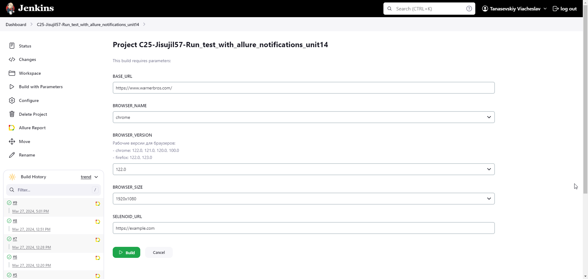 

<br>


<a id="allure"></a>

## </a> <a name="Allure"></a>Allure report с историей: </a> 
**Allure Report** — это гибкий и лёгкий инструмент для создания и просмотра графических отчётов о прохождении тестов. 

### Overview

<details>
<summary>Скриншот</summary>
<p align="left">  
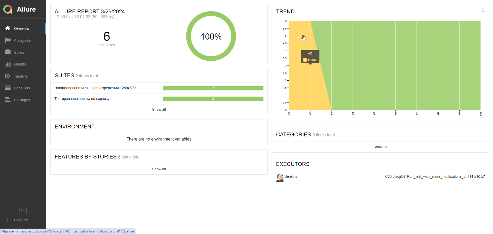  
</p> 
</details>

### Suites

<details>
<summary>Скриншот</summary>
<p align="left">  
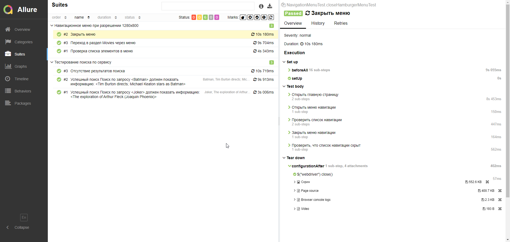  
</p>
</details>

### Graphs

<details>
<summary>Скриншоты</summary>

<p align="left">
  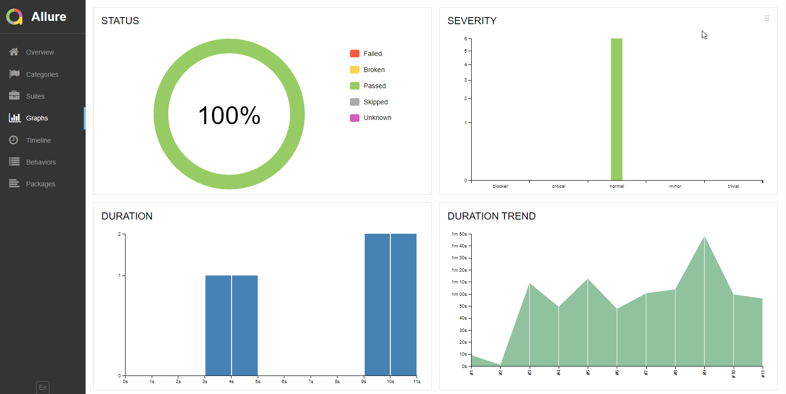
  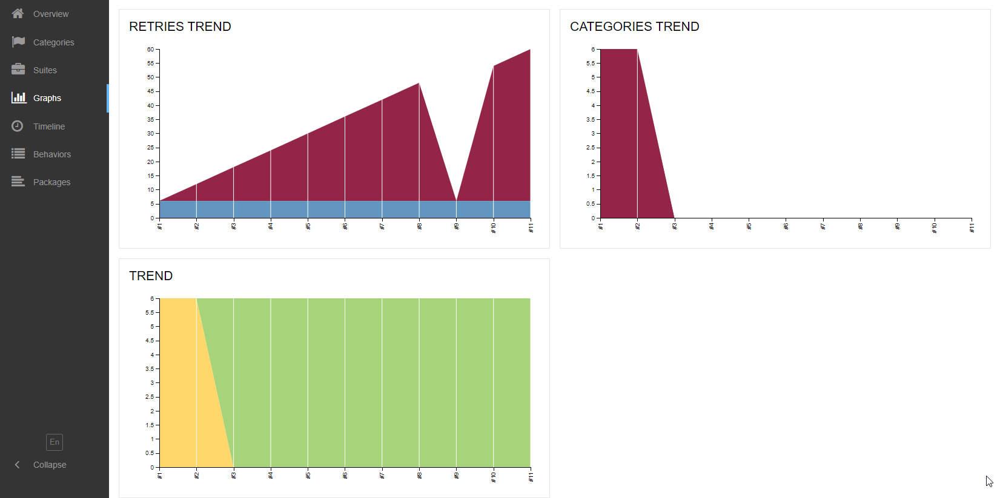
</p>
</details>
<br>

## <a name="telegram"></a>Уведомление об упавших тестах в Telegram</a> </a>
**Allure notifications** - это библиотека, позволяющая выполнять автоматическое оповещение о результатах прохождения автотестов, которое направляется в нужный вам мессенджер

<details>
<summary>Скриншоты</summary>

<p align="left">
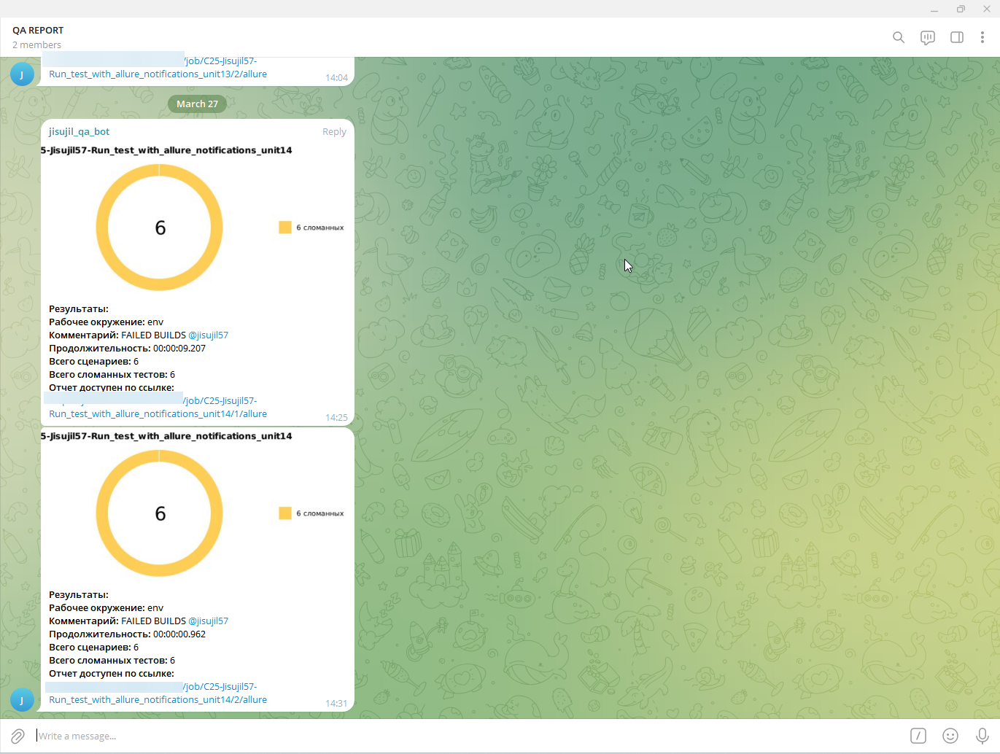
</p>
</details>
<br>


<a id="testops"></a>
## <a name="TestOps"></a>Allure TestOps интеграция</a> </a>
<details>
<summary>Скриншоты</summary>

<p align="left">
  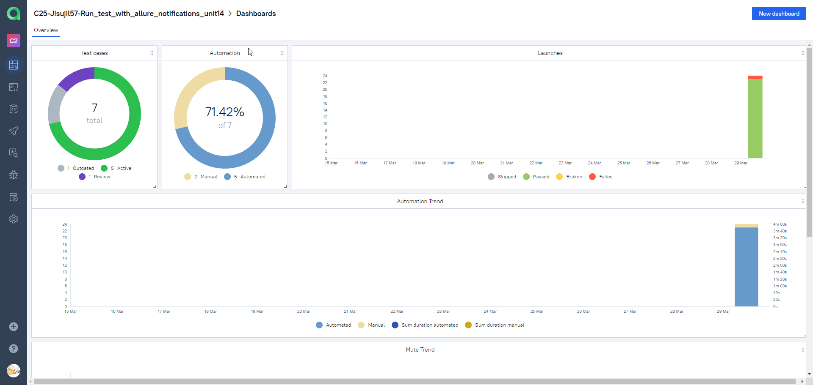
  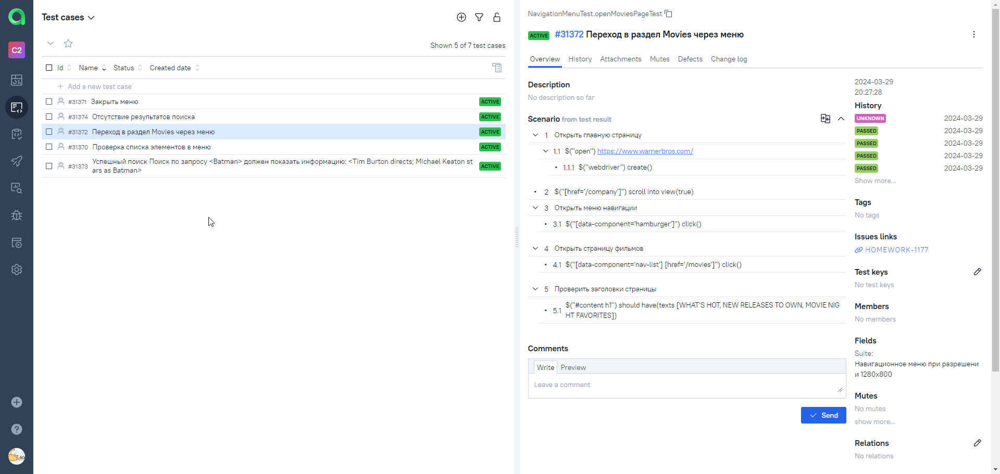
  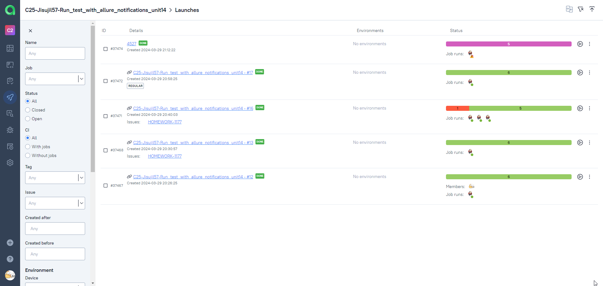
</p>
</details>
<br>


<a id="jira"></a>
## <a name="Jira"></a>Allure TestOps + Jira интеграция</a> </a>
<details>
<summary>Скриншот</summary>

<p align="left">
  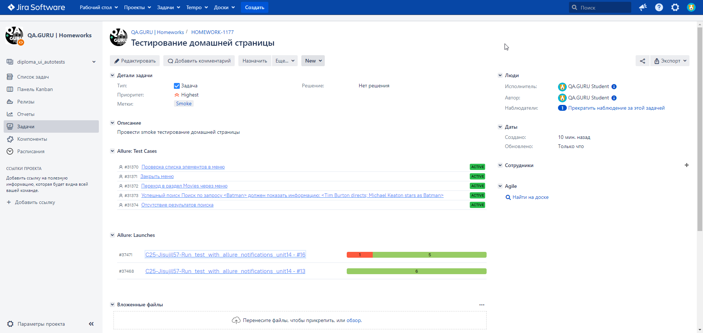
</p>
</details>
<br>

<a id="video"></a>
## <a name="Selenoid"></a>Пример прогона автотеста в Selenoid</a> </a>
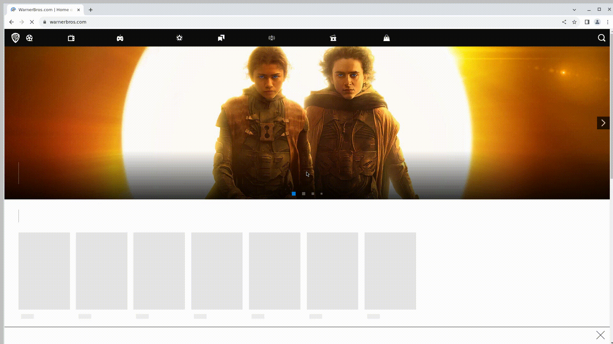


