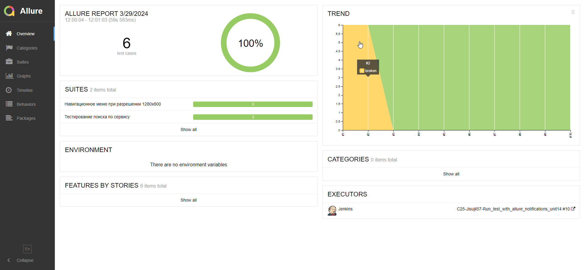

# Проект по автоматизации тестирования web-сервиса www.warnerbros.com

## **Содержание:**

* <a href="#tools">Технологии и инструменты</a>
* <a href="#cases">Примеры автоматизированных тест-кейсов</a>
* <a href="#runner">Запуск автотестов</a>

<a id="tools"></a>
## <a name="Технологии и инструменты">**Технологии и инструменты:**</a>

<p align="center">  
<a href="https://www.jetbrains.com/idea/"></a>  
<a href="https://www.java.com/"></a>  
<a href="https://gradle.org/"></a>
<a href="https://junit.org/junit5/"></a>
<a href="https://selenide.org/"></a> 
<a href="https://aerokube.com/selenoid/"></a>  
<a href="ht[images](images)tps://github.com/allure-framework/allure2"></a> 
<a href="https://qameta.io/"></a>   
<a href="https://www.jenkins.io/"></a>  
<a href="https://www.atlassian.com/ru/software/jira/"></a>  
</p>

<a id="cases"></a>
## <a name="Примеры автоматизированных тест-кейсов">**Примеры автоматизированных тест-кейсов:**</a>

- Успешный поиск по ключевому слову
- Наличие ошибки при отсутствии результатов поиска
- Наличие списка разделов сайта в бургер меню при разрешении 1280x800
- Закрытие меню при разрешении 1280x800
- Переход в раздел Movies через меню

<a id="runner"></a>
## Запуск автотестов
**Локальный запуск:**
```bash  
gradle clean test
```

**Удалённый запуск через Jenkins (Build with Parameters):**

<details>
<summary>Параметры</summary>

- `${BASE_URL}` - базовый URL тестируемого сайта  
- `${BROWSER_NAME}` - название браузера  
- `${BROWSER_VERSION}` - версия браузера  
- `${BROWSER_SIZE}` - разрешение браузера  
- `${SELENOID_URL}` - базовый URL контейнера Selenoid  

</details>


```bash  
test
-DbaseUrl=${BASE_URL}
-Dbrowser=${BROWSER_NAME}
-DbrowserVersion=${BROWSER_VERSION}
-DbrowserSize=${BROWSER_SIZE}
-DselenoidUrl=${SELENOID_URL}
```

<a id="allure"></a>
## </a> <a name="Allure"></a>Allure report с историей</a>

### Overview
<details>
<summary>Скриншот</summary>
<p align="left">  
  
</p> 
</details>

### Suites
<details>
<summary>Скриншот</summary>
<p align="left">  
  
</p>
</details>

### Graphs
<details>
<summary>Скришноты</summary>

<p align="left">
  
  
</p>
</details>

